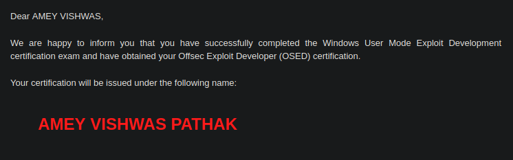

# The Breakthrough

On December 19th, 2023, at 5:30 PM, I nervously began my second attempt at the OSED exam. My first attempt on October 31st had ended in disappointment, but I had spent the following months working tirelessly to prepare. To my surprise, by the eight-hour mark, I had already earned enough points to pass the exam, having successfully completed 2 out of the 3 challenges.

The hard work paid off. I submitted my report on December 22nd at 2:30 AM, and after two anxious days of waiting, I woke up on the morning of December 24th at 7:00 AM to find an email that changed everything:

I couldn't believe it—I had just passed my first cybersecurity certification! At 19, I am one of the youngest Indians to pass the exam. After months of sleepless nights and relentless preparation, I had finally achieved my goal. It was the perfect Christmas Eve gift, and a moment I will never forget.

We will go through my entire journey of preperation and multiple resources i used that helped me pass the exam.

# OSED Overview

